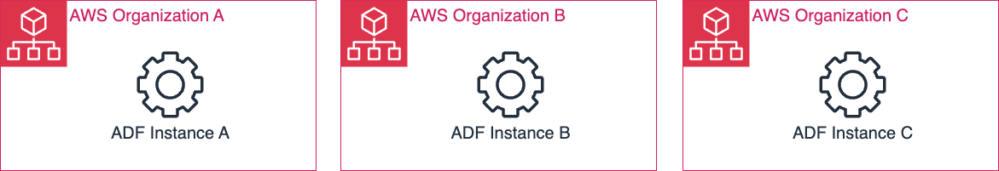
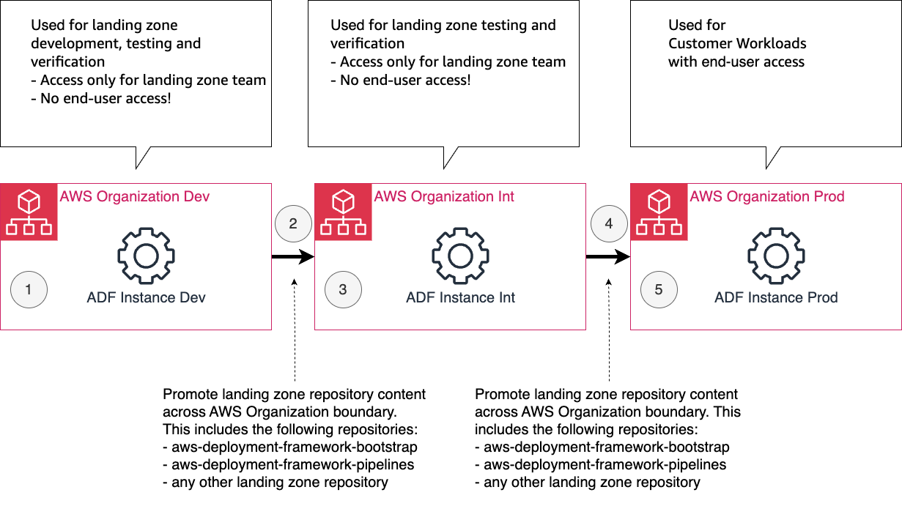

# Multi-Organization ADF Setup Guide

This document describes how ADF can be run and managed in a multi AWS organization setup.

- [Intended Audience](#intended-audience)
- [Definition of a Multi-Organization ADF Setup](#definition-of-a-multi-organization-adf-setup)
- [Common Use Case for a Multi-Organization ADF Setup - A Multi-Stage Landing Zone](#common-use-case-for-a-multi-organization-adf-setup---a-multi-stage-landing-zone)
- [Propagating Code Changes Between ADF Installations](#propagating-code-changes-between-adf-installations)
- [Customizing ADF Config Per AWS Organization](#customizing-adfconfig.yml-per-aws-organization)
- [Best Practices for Multi-Organization ADF setups](#best-practices-for-multi-organization-adf-setups)
  - [1. Create a dedicated adfconfig.yml Per AWS Organization](#1-create-a-dedicated-adfconfigyml-per-aws-organization)
  - [2. Design Multi-Organization ADF Deployment Maps](#2-design-multi-organization-adf-deployment-maps)
  - [3. Make the AWS Organization Stage Context Available in CodePipeline Build jobs](#3-make-the-aws-organization-stage-context-available-in-codepipeline-build-jobs)
  - [4. Customize the Base IAM Roles Per Organization](#4-customize-the-base-iam-roles-per-organization)

## Intended Audience
This guide is intended for users that run a large scale AWS Organization with complex ADF application deployments and large numbers of ADF deployment pipelines.
Enterprises usually best meet the criteria for a multi AWS organization setup. We therefore refer to "Enterprises" as the target audience in the section below.
However, the approach described here should be applied to smaller organizations as well; assuming that sufficient engineering staff is available to support a multi AWS organization setup.

## Definition of a Multi-Organization ADF Setup 
A multi-organization AWS-Deployment-Framework (ADF) setup describes a scenario where an 
enterprise (or any user) maintains more than one AWS Organizations and each with it's own
dedicated ADF installation. 

The following diagram shows such a setup in the most generic level:



## Common Use Case for a Multi-Organization ADF Setup - A Multi-Stage Landing Zone
The most common use case for a multi-organization ADF setup is a multi-stage (and multi-organization) [landing zone](https://docs.aws.amazon.com/prescriptive-guidance/latest/migration-aws-environment/understanding-landing-zones.html). Such a setup enables stable landing zone feature development that is otherwise not possible in a single AWS Organization.

Let's assume that "Enterprise A" has a dedicated "prod" AWS Organization. This "prod" AWS Organization is used by it's end users to run all their workloads. In a single AWS Organization setup, the "prod" AWS Organization is be the only AWS Organization that exists. As part of the  multi-organization ADF setup, we now add a separate "dev" and "int" AWS Organization. The following diagram shows such an architecture:


The development flow is as follows: 
1. Development work for any landing zone feature always starts in the "dev" AWS Organization. The ADF repository `aws-deployment-framework-bootstrap` and `aws-deployment-framework-pipelines` are also considered a landing zone feature. The "dev" AWS Organization is exclusivly reserved for the landing zone development team. No end-user has access to the "dev" AWS Organization.
2. Once the code under development is stable and underwent successful unit and basic integration tests, it is moved from the "dev" AWS Organization to the "int" AWS Organization. The process of propagating code form one AWS Organization to another is described here [Propagating Code Changes Between ADF Installations](#Propagating-Code-Changes-Between-ADF-Installations).
3. The "int" AWS Organization is used for final integration testing and verification. The "dev" AWS Organization is exclusivly reserved for the landing zone development team. No end-user has access to the dev org.
4. Once all tests passed successfully, the code is moved from the "int" AWS Organization to the "prod" AWS Organization.
5. Assuming that the propagation and the deploymemt in the "prod" AWS Organization was successful, the code is now fully deployed in the "prod" AWS Organization and is available to the end-users.

The benefits of such a setup is that an Enteprise can apply the same common `Software Development Lifecycle` to typical "one-off" landing zone services that are hard to test in a single-orgaization setup. It enables an Enterprises 'Cloud Center of Excellence' (landing zone team) a 
controlled process to develop, test and validate changes to wide reaching mission-critical 
services, including but not limited to:
- Service Control Policies changes.
- Identity Center and IAM based Access Management Configuration changes.
- Deployment Framework changes.
- AWS Organization changes; including OU structure.
- Control Tower and Account Provisioning configurations changes.
- Centralized security service configuration changes.
- Centralized cost management configuration changes.
- Centralized networking changes.

The following sections are written in the context of this "".

## Propagating Code Changes Between ADF Installations 
With multiple ADF configurations across multiple AWS organization there comes a new challenge to maintain repositories and its configurations across multiple environments. 
This applies to the following repositories: 
- aws-deployment-framework-bootstrap
- aws-deployment-framework-pipelines
- any other landing zone repository

As the requirements of the bootstrapped resources and adf configuration evolve they need to be updated over time, and these changes ideally propagated from one Installation to the next in a coordinated, controlled fashion.

With an `Environment Branching` approach it's possible to build a 'hands-off' 
automated mechanism to Promote from a "dev" AWS Organization installation to a "prod" AWS Organization installation.
This means that for example merging code from the "dev" branch of a repository to the "int" branch of a repository, will trigger the deployment process in the "int" AWS Organization.

Implementing such an approach is out of scope of this guide and it heavily depends on the specific source code & CICD tool in use. 


## Best Practices for Multi-Organization ADF setups
If you want to run ADF in a multi-organization setup, there are various best practices that should be followed.
When following these recommendations, the content of the repository `aws-deployment-framework-bootstrap` and `aws-deployment-framework-pipelines` should be stage agnostic. 
This means that you can copy and paste the content of any of those two repositories into any AWS Organization stage ("dev", "int", "prod") and ADF will behave exactly 

### 1. Create a dedicated adfconfig.yml Per AWS Organization
One challenge with synchronising the aws-deployment-framework-bootstrap repository
across AWS Organizations is that the contents of the `adfconfig.yml` configuration
file is typically tailored to the ADF installation. The can be solved by adding a 
custom adfconfig file for the given organization.

Adding a configuration file with the name pattern `adfconfig.{organization id}.yml`
in the root of the `aws-deployment-framework-bootstrap` repository will take
precedence over the default `adfconfig.yml` settings file for that organization.

For each AWS organization used with the ADF Framework setup an additional adfconfig
file can be defined.


### 2. Design Multi-Organization ADF Deployment Maps
The Deployment Maps for ADF exist in the codecommit repository
`aws-deployment-framwork-pipelines` within the deployment 
account. Some additional Multi-Org challenges exist when defining targets for Deployments. As a high-level goal, a deployment map should be setup in such a way, that it can be copied over from one ADF instance to another without breaking / requiring any change.

The following considerations should be observed when creating Deployment Maps for an multi-organization ADF setup:
1. Create Organization-agnostic deployment maps
    - As a best-practice, deployment maps should be free of any hardocded AWS Account Ids for Deployment Map Targets, unless the deployment is destined for a single AWS Organization.
    - Instead, target AWS accounts via `Account Names`, `Account Tags` or `OU Paths`
    which ADF will then use to dynamically generate the respective Account IDs 
    Target List when updating the Pipelines. 
2. Consider AWS service limits for AWS CodePipeline
    - In a large enteprise setup the number of targets in a "prod" AWS Organizations AWS CodePipeline
  stage may be much greater than in predecessing stages of the "int" and "prod" AWS Organizations.
    - Review the Codepipeline action limitations.
    - ADF distributes targets across AWS CodePipeline stages within a AWS CodePipeline on a best efforts basis, however 
    deployments may need to be distributed across multiple AWS CodePipeline when upper limits are reached.
    - The current limits are ([AWS CodePipeline Limits](https://docs.aws.amazon.com/codepipeline/latest/userguide/limits.html))
      - 1000 AWS CodePipeline per AWS Account per region
      - 500 Actions per AWS CodePipeline
      - 50 Actions per AWS CodePipeline Stage
    - This implies that a single ADF pipeline can target 500 AWS accounts max. At this point latest, the ADF pipeline needs to be manually rebalanced into smaller individual ADF pipelines.
3. Allow for empty deployment map targets
    - With the adfconfig setting `allow-empty-target` ([ADF Admin Guide](admin-guide.md)), ADF can be instructed to ignore any target that is not resolvable or empty (because no AWS Accounts exists in it). It is suggested to set this setting to `True`. Eventhough the OU structure and general setup across the different AWS Organization stages is usually identical, the number of created AWS Accounts might not. With this setting to `True`, temporary empty OUs are just ignored and do not lead to an error.

 4. The source branch for the application code may be different per AWS Organization
    - The above described custom `adfconfig` configuration allows a different default 
  branch to be specified in the path `config.scm.default-scm-branch` per AWS Organization

### 3. Make the AWS Organization Stage Context Available in Codepipeline Build jobs
ADF applications often contain environment / AWS Organization stage specific configuration files. 
In order to allow AWS Codebuild to select the proper configuration context for an application, the environment / AWS Organization stage context needs to be made available. 
A simple pattern to solve this problem is the introduction of the SSM parameter `adf/org/stage` in  the buildspec file of the application.
The following snippet shows the header of such a `codebuild.yaml` file. 
```
env:
  parameter-store:
    ADF_ORG_STAGE: "/adf/org/stage"
[...]
```
This environment variable can then be used to drive decision/deployment logic
within any of the subsequent build commands/actions.
Some scenarios which could require Org specific context:
- Deriving the default log level based on the org stage for
a specific CDK application 
- Appending the Stage name to AWS resource names having a requirement to be 
both deterministic as well as globally unique 
(whilst being deployed into multiple organizatinos)
- Selection a config file from a config folder with the following files:
    - `config-dev.yaml`
    - `config-int.yaml`
    - `config-prod.yaml`

### 4. Customize the Base IAM Roles Per Organization
ADF Supports Bootstrapping Baseline Cloudformation Stacks to all accounts
when they first join an AWS Organization and centrally governing the subsequent 
Lifecycle of those Stacks. [See Here](admin-guide.md#bootstrapping-accounts) 

These Baseline Templates are typically used for Setting up Default IAM Roles and
Policies necessary for the foundations of an ADF Based Enteprise Landing Zone. 

In guidance with AWS Security Guidelines and `Least Privilege Access Principles`,
it it recommended to reduce the scope of any IAM Policy to the minimum required
Actions, Principals and Resource Scope necessary. 

To customize the scope of which resources or Principals are permitted within the
IAM Policies of the Baseline templates CFN Mapping fields can be utilized based 
on the `Org Stage` SSM Parameter. As shown below:

```
Parameters:
  OrgStage:
    Type: "AWS::SSM::Parameter::Value<String>"
    Description: Org Stage
    Default: /adf/org/stage
# At the time this Stack is deployed, the FinOps Account ID SSM Parameter doesn't
# exist, so we derive it from mapping it to the org stage
Mappings:
  # Usage:!FindInMap [OrgStageBasedPropertyMap, !Ref OrgStage, FinOpsAccountId]
  OrgStageBasedPropertyMap:
    dev:
      FinOpsAccountId: 1234567891012 # Dev Org 
    int:
      FinOpsAccountId: 1234567891013 # Int Org
    prod:
      FinOpsAccountId: 1234567891014 # Prod Org
```
In the above usage example you can see how the Cloudformation function FindInMap
`!FindInMap [OrgStageBasedPropertyMap, !Ref OrgStage, FinOpsAccountId]` can be
utilized to dynamically reference a custom 'AccountId' within the template,
enabling the construction of account specific granular Resource and Principal ARNs.