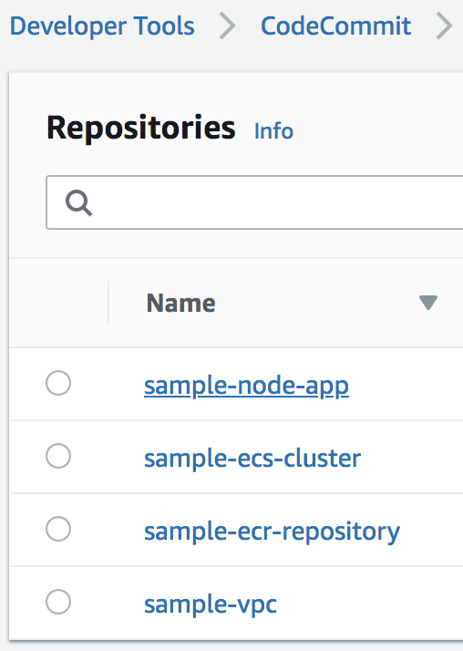

# Samples Guide

**Note:** This guide assumes the Deployment account has been bootstrapped, please see the [admin guide](./admin-guide.md) before continuing.

As a way to get started with the AWS Deployment Framework we have included some basic examples pipelines and resources. This guide will step through the processes of getting these samples up and running to showcase how the ADF functions.

The samples include:
  - A VPC CloudFormation Template.
  - A Elastic Container Registry Repository (ECR) Template.
  - A Elastic Container Service (ECS) Cluster Template.
  - A Simple NodeJS Express Application to run in Fargate.

ADF is able to deploy all sorts of resource from AWS CloudFormation templates, applications running in Containers and Serverless Applications to name a few. In this guide we will a foundational VPC with associated resources along with a ECR Repository to hold our shared container images. Once the VPC is in place we can deploy a ECS Cluster that will run our sample application.

ADF supports multiple source locations for pipelines, in this example we will use CodeCommit as the source for our pipelines. Firstly, we will need to define an AWS Account where our source code originates from. In a real world example we should assume that the account where the source code is kept and maintained is completely different from that which performs the deploy action and again different from that which runs the application. The regions used in this guide *(us-west-2, eu-west-1)* have been defined as target regions in *adfconfig.yml* and the deployment account has been bootstrapped as defined in the [admin guide](./admin-guide.md).

Let's create a new AWS Account called `banking-source` via AWS Organizations that will act as a point of entry for our sample code. The role name we choose when we create a new account must match that of the one we define in out `adfconfig.yml`. *(Leave blank for default)*


Lets also create a new OU called `banking/source`. On this account, teams would work from different CodeCommit repositories and build applications, resources and projects related to the banking section of the hypothetical organization.


Once we have created the new OU, we can move our newly created account into this OU. Since we didn't define a specific CloudFormation template for the `banking/source` OU, ADF will recursively search and attempt to find an appropriate base template *(global.yml or regional.yml)* in Amazon S3. Firstly in the `banking` folder and then in the root. You define the templates and their associated OUs in the `aws-deployment-framework-bootstrap` repository on the Master Account. By default, we include the `global.yml` in the root of the *bootstrap_repository* folder that can act as a fall back *(default)* and be append to as required.

If we look at AWS Step Functions in the master account in *us-east-1* we can see the progress of the bootstrap process.


Once complete we will have our base stack complete in our newly created AWS Account.


Now that this account has been bootstrapped, let's setup two more accounts that will act as our testing and production accounts for the purpose of this guide. We create these via AWS Organizations as we did before. Let's also create `banking/testing` and `banking/production` Organizational Units so that we can move these accounts into them. From this action the bootstrapping process will occur again and we will end up with our base stacks configured for our two new accounts.


Now we have three accounts *(plus the deployment account)* that have been bootstrapped. Let's create our first pipeline that will deploy our VPC CloudFormation template to our new accounts.

On the *banking-source* account, create CodeCommit Repositories *(in our main deployment region)* to store our sample code in. Create one for each separate project we plan on deploying with the names:

- sample-vpc
- sample-ecr-repository
- sample-ecs-cluster
- sample-node-app

These names will pair up with an associated pipeline in the deployment account.



For now we can leave these empty, we will push to them with some code once the pipeline is created. *Note:* Pipelines can be created without the source *(CodeCommit repository in this case)* existing. When the source does get created and the code lands on the specified branch, the pipeline will kick off automatically.

Open your `deployment_map.yml` file and add in the following pipeline:

```yaml
pipelines:
  - name: sample-vpc
    type: cc-cloudformation
    params:
      - SourceAccountId: 111111111111 # <-- This is the AccountId of your source account
      - RestartExecutionOnUpdate: True
    targets:
      - path: /banking/testing
        regions: eu-west-1
      - path: approval
        name: manager_approve
      - path: /banking/production
        regions: us-west-2
```

The *SourceAccountId* will be the Account Id of the account we created in the `banking/source` OU. In this pipeline we have specified we want to deploy to two different regions as part of the stages. If you wish to deploy to the *"default"* region *(the one your deployment account is setup globally in)* you can omit the key as you will see below with our ECR Repository deployment.

Once we have updated our deployment map we can push these changes to the `aws-deployment-framework-pipelines` repository in the Deployment Account.


When the `CreateOrUpdatePipelines` step is complete you will be able to see a new Pipeline in CodePipeline for `sample-vpc`.


Now that we have a delivery mechanism to get our source code into various accounts we can initialize the `sample-vpc` folder as a git repository and define some parameters for our deployment.

We want to ensure that we pass a different value for `Environment` depending on which account we have deployed into. One way to do this is to create specific account name based parameter files such as `banking-production.json` *(that is the name of my account)*. We can also use high level constructs such as OU Id *(see admin guide)* to cover large amounts of accounts.

Let's create `banking-production.json` as:

```json
{
    "Parameters": {
        "Environment": "production"
    },
    "Tags" : {
      "Environment" : "production"
    }
}
```

We can leave the `global.json` file as:

```json
{
    "Parameters": {
        "CostCenter": "123",
        "Environment": "testing"
    },
    "Tags" : {
      "Environment" : "testing"
    }
}
```

In this case, *global.json* will act as a fall back and will also merge the `CostCenter` property into the lower level account specific parameter files. This means that `banking-testing` will get a copy the parameters in `global.json` since we didn't explicitly specify any parameters for it *(or a file)*.

We're now ready to push into our CodeCommit Repository in our source account *(in main deployment region)*. Once we push to our repository we can see our Pipeline kick off in the Deployment account.

The `sample-vpc` pipeline will run until it comes to the approval stage we defined in our definition. From there we can choose to allow the deployment into the Production account. Once the pipeline is complete our VPC resources will be deployed into two accounts across two regions.

Let's now deploy our `ecr-repository` CloudFormation template. We want to create a shared container repository that can be used to store Docker images and allow accounts access to pull from the repository as required. Since it will be a shared resource we can choose to deploy this into an account that might be considered a *"shared"* account across business units or environments. In this example we will use the Deployment account as the shared account.

We can extend our `deployment_map.yml` file to include the new pipeline, *(remeber to update params)*:

```yml
  - name: sample-ecr-repository
    type: cc-cloudformation
    params:
      - SourceAccountId: 111111111111
    targets:
      - /deployment # For targets you can always use shorthand notation to define a path or account ID
```

Once we add and commit this we can push into our `aws-deployment-framework-pipelines` repository in order to have our pipeline created. In this pipeline we do not specify a path or region key since we want this to deploy into our default deployment account region.

Before we push our `sample-ecr-repository` into the CodeCommit repository on the source account we made earlier lets adjust the parameters.

```json
{
    "Parameters": {
        "TestingAccountId": "11111111111",
        "ProductionAccountId": "222222222222"
    }
}

```

Update the `TestingAccountId` and `ProductionAccountId` to match that of your testing and production account. In this case we can keep our parameters in `global.json` since we are only deploying to a single account.


Once complete we have a ECR Repository in our Deployment Account that will be shared with our two new banking accounts.

Let's add in our ECS Cluster pipeline to our Deployment Map.

```yml
  - name: sample-ecs-cluster
    type: cc-cloudformation
    params:
      - SourceAccountId: 111111111111
    targets:
      - path: /banking/testing
        regions: eu-west-1
      - path: /banking/production
        regions: us-west-2
        name: production # Names of stages can be used to give clarity
```

Once we add and push this we will have our new `sample-ecs-cluster` pipeline. We can adjust our parameter files *(add tags etc)* if required and push our `sample-ecs-cluster` content to the repository in the `banking-source` account we made earlier.

*Note:* Adding tags to the parameters files will propagate the tags to the resources with the [stacks automatically](https://docs.aws.amazon.com/AWSCloudFormation/latest/UserGuide/aws-properties-resource-tags.html).

After the pipeline has completed we have an ECS Cluster in our `testing` account and our `production` account ready to have applications deployed onto it.

Now we're ready to deploy our NodeJS application to our ECS Clusters in testing and production.

Let's add the pipeline we need into the map once more.

```yml
  - name: sample-node-app
    type: cc-cloudformation
    action: replace_on_failure
    params:
      - SourceAccountId: 111111111111
      - Image: aws/codebuild/docker:18.09.0
    targets:
      - path: /banking/testing
        regions: eu-west-1
      - path: /banking/production
        regions: us-west-2
```

Notice this time we are passing in which **Image** *(overriding the default)* we want AWS CodeBuild to use during its build phase. Parameters from the definition like this are passed directly into the Jinja2 template. During the *Build* phase of this pipeline, CodeBuild will build the *Dockerfile* in the `sample-node-app` project and push the image into the ECR Repository we created on the Deployment Account. We are also using an *action* of **replace_on_failure**, there are numerous types of CloudFormation action types [you can choose from](https://docs.aws.amazon.com/AWSCloudFormation/latest/UserGuide/continuous-delivery-codepipeline-action-reference.html#w2ab1c13c13b9).

Once you push this code base into the repository on the source account the pipeline will be underway.


Once the application has been deployed to the target accounts and regions, you can access the application via the exported value of the Load Balancer External URL on the ECS Cluster CloudFormation stack within the target accounts.


Accessing the *ExternalUrl* output in your web browser, you should be greeted with the application running inside AWS Fargate.

For more CloudFormation templates you can use with ADF see [Github](https://github.com/awslabs/aws-cloudformation-templates)