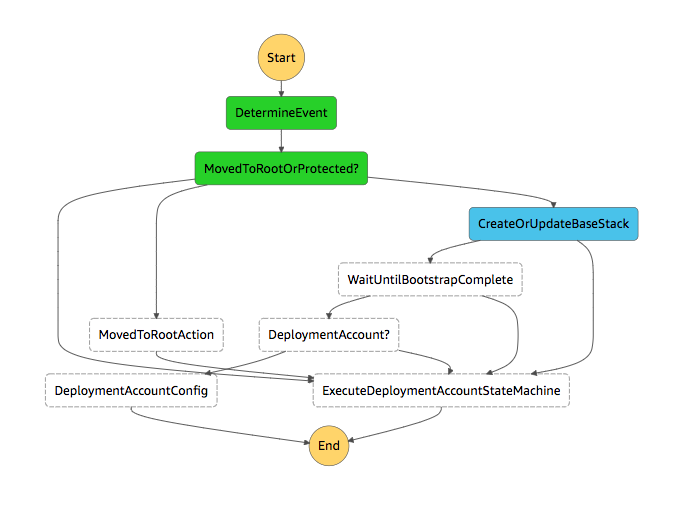

# Samples Guide

ADF is capable of deploying numerous types of resources or workloads from ETL pipelines, Container Workloads, Serverless Application or standard line of business applications running on Amazon EC2.

Because of the range of capabilities, we have included some sample repositories to get you started. Each sample contains a *readme.md* to explain the details of the sample along with a description of how the sample pipeline could be defined within a deployment map file. If you have any samples that you use and find useful, please contribute to this repository.

The below guide highlights a few of these examples and helps get them setup when deploying ADF from scratch.

**Note:** This guide assumes the Deployment account has been bootstrapped, please see the [installation guide](./installation-guide.md) before continuing.

The samples this guide will cover deploying are:
  - A VPC CloudFormation Template.
  - A Elastic Container Registry Repository (ECR) Template.
  - A Elastic Container Service (ECS) Cluster Template.
  - A Simple NodeJS Express Application to run in AWS Fargate.

In this guide, we will deploy a foundational VPC with associated resources along with a ECR Repository to hold our shared container images. Once the VPC is in place, we can deploy a ECS Cluster that will run our sample NodeJS application.

ADF supports multiple source types *(Github, CodeCommit, S3, CodeStar)* for pipelines, in this example we will use AWS CodeCommit as the source for our pipelines. Firstly, we will need to define an AWS Account where our source code originates from. In a real world example, we should assume that the account where the source code is kept and maintained is different from that which performs the deploy action, and again, different from that which actually runs the application. The regions used in this guide *(us-west-2, eu-west-1)* have been defined as target regions in *adfconfig.yml* and the deployment account has been bootstrapped as defined in the [installation guide](./installation-guide.md).

Let's create a new AWS Account called `banking-source` via AWS Organizations that will act as a point of entry for our sample code. The role name we choose when we create a new account must match that of the one we define in out `adfconfig.yml`. *(Leave blank for default)*


Lets also create a new OU called `banking/source`. On this account, teams would work from different AWS CodeCommit repositories and build applications, resources and projects related to the banking section of this hypothetical organization.


Once we have created the new OU, we can move our newly created account into this OU. Since we did not define a specific CloudFormation template for the `banking/source` OU, ADF will recursively search and attempt to find an appropriate base template *(global.yml or regional.yml)* in our bootstrap S3 Bucket. Firstly, the bootstrap process will check in the `banking` folder and then, if nothing found, in the root. You define the templates and their associated OUs in the `aws-deployment-framework-bootstrap` repository on the Master Account. By default, there is a `global.yml` in the root of the *bootstrap_repository* repository that can act as a fall back *(default)* and be append to as required.

If we look at AWS Step Functions in the master account in *us-east-1* we can see the progress of the bootstrap process.



Once complete we will have our base stack complete in our newly created AWS Account.


Now that this account has been bootstrapped, let's setup two more AWS accounts that will act as our testing and production accounts for the purpose of this guide. We create these via AWS Organizations as we did before. Let's also create `banking/testing` and `banking/production` Organizational Units so that we can move these accounts into them. From this account moving action the bootstrapping process will occur again and we will end up with our base stacks configured for our two new accounts.


Now we have three accounts *(plus the deployment account)* that have been bootstrapped. Let's create our first pipeline that will deploy our VPC CloudFormation template to our new accounts.

Open your `deployment_map.yml` file *(or create a new one)* and add in the following pipeline:

```yaml
pipelines:
  - name: sample-vpc
    default_providers:
      source:
        provider: codecommit
        properties:
          account_id: 111111111111
    params:
      restart_execution_on_update: True
    targets:
      - path: /banking/testing
        regions: eu-west-1
      - path: approval
        name: manager_approve
      - path: /banking/production
        regions: us-west-2
```

The *account_id* will be the Account Id of the account we created in the `banking/source` OU. In this pipeline we have specified we want to deploy to two different regions as part of the stages. If you wish to deploy to the *"default"* region *(the one your deployment account is setup globally in)* you can omit the key, as you will see below with our ECR Repository deployment.

Once we have updated our deployment map file, we can push these changes to the `aws-deployment-framework-pipelines` repository in the Deployment Account. *(Clone this first if you have not yet done so)*


When the `CreateOrUpdatePipelines` step is complete you will be able to see a new Pipeline in AWS CodePipeline called `sample-vpc`.


Now that we have a delivery mechanism to get our source code into various accounts we can initialize the `sample-vpc` folder *(in samples)* as a git repository and define some parameters for our deployment.

In this sample, we want to ensure that we pass a different value for `Environment` parameter depending on which account we have deployed into. One way to do this is to create specific account name based parameter files such as `banking-production.yml` *(that is the name of an account we created)*. We can also use high level constructs such as OU Id *(see admin guide)* to cover large amounts of accounts.

Let's create `banking-production.yml` as:

```yaml
Parameters:
    Environment: production
Tags:
    Environment: production
    CostCenter: team-x
```

We can leave the `global.yml` file as:

```yaml
Parameters:
    CostCenter: overhead
    Environment: testing
Tags:
    Environment: testing

```

In this case, *global.yml* will act as a fall back and will also merge the `CostCenter` property into the lower level account specific parameter files. This means that the `banking-testing` account will get a copy of the parameters in `global.yml` since we didn't explicitly specify any parameters for it *(or a file)*.

We're now ready to push into our CodeCommit Repository in our source account *(in main deployment region)*. Once we push to our repository we can see our Pipeline kick off in the Deployment account.

The `sample-vpc` pipeline will run until it comes to the approval stage we defined in our definition. From there we can choose to allow the deployment into the Production account. Once the pipeline is complete our VPC resources will be deployed into two accounts across two regions.

Let's now deploy our `sample-ecr-repository` CloudFormation template. We want to create a shared container repository that can be used to store Docker images and allow accounts access to pull from the repository as required. Since it will be a shared resource we can choose to deploy this into an account that might be considered a *"shared"* account across business units or environments. In this example we will use the Deployment account as the shared account.

We can extend our `deployment_map.yml` file to include the new pipeline:

```yml
  - name: sample-ecr-repository
    default_providers:
      source:
        provider: codecommit
        properties:
          account_id: 111111111111
    targets:
      - 99999999999 # The Account ID of your Deployment Account
```

Once we add and commit this, we can push it into our `aws-deployment-framework-pipelines` repository in order to have our pipeline created. In this pipeline we do not specify a path or region key since we want this to deploy into our default deployment account region.

Before we push our `sample-ecr-repository` into the CodeCommit repository on the source account lets adjust the parameters.

```yaml
Parameters:
    TestingAccountId: '11111111111'
    ProductionAccountId: '222222222222'
```

Update the `TestingAccountId` and `ProductionAccountId` to match that of your testing and production account. In this case, we can keep our parameters in `global.yml` since we are only deploying to a single account *(the deployment account)*.


Push the contents to the `sample-ecr-repository` CodeCommit repository we created earlier. Once complete, we have a ECR Repository in our Deployment Account that will be used to share container images with our two new banking accounts.

Let's add in our ECS Cluster pipeline to our Deployment Map.

```yml
  - name: sample-ecs-cluster
    default_providers:
      source:
        provider: codecommit
        properties:
          account_id: 111111111111
    targets:
      - path: /banking/testing
        regions: eu-west-1
      - path: /banking/production
        regions: us-west-2
        name: production # Names of stages can be used to give clarity
```

Once we add the above to our `deployment_map.yml` and push this to our deployment account, we will have our new `sample-ecs-cluster` pipeline and its associated repository. We can adjust our parameter files *(add tags etc)* if required and push our `sample-ecs-cluster` content to the repository in the `banking-source` account that was created for us.

*Note:* Adding tags to the parameters files will propagate the tags to the resources with the [stacks automatically](https://docs.aws.amazon.com/AWSCloudFormation/latest/UserGuide/aws-properties-resource-tags.html).

After the pipeline has completed we have an ECS Cluster in our `testing` account and our `production` account ready to have applications deployed onto it.

Now we're ready to deploy our NodeJS application to our ECS Clusters in testing and production.

Let's add the pipeline we need into the map once more.

```yml
  - name: sample-fargate-node-app
    default_providers:
      source:
        provider: codecommit
        properties:
          account_id: 111111111111
      build:
        provider: codebuild
        properties:
          image: standard_2_0
      deploy:
        provider: cloudformation
        properties:
          action: replace_on_failure
    targets:
      - path: /banking/testing
        regions: eu-west-1
      - path: /banking/production
        regions: us-west-2
```

Notice this time we are passing in which **image** *(overriding the default)* we want AWS CodeBuild to use during its build phase. Parameters from the definition like this are passed directly into the AWS CDK as input to generate our pipeline in a specific way. During the *Build* phase of this pipeline, CodeBuild will build the *Dockerfile* in the `sample-fargate-node-app` project and push the image into the ECR Repository we created on the Deployment Account. We are also using an *action* of **replace_on_failure** as part of our deployment stages. There are numerous types of CloudFormation action types [you can choose from](https://docs.aws.amazon.com/AWSCloudFormation/latest/UserGuide/continuous-delivery-codepipeline-action-reference.html#w2ab1c13c13b9). Add and commit this new pipeline to the pipelines repository on the deployment account.

Once we have the pipeline we need, we can push the `sample-fargate-node-app` code into the repository on the source account the pipeline will be underway.


Once the application has been deployed to the target accounts and regions, you can access the application via the exported value of the Load Balancer External URL on the *ECS Cluster* AWS CloudFormation stack within the target accounts.


Accessing the *ExternalUrl* output in your web browser, you should be greeted with the application running inside AWS Fargate.

For more samples, please see the other pipeline/resource definitions in the samples folder, or check out the numerous CloudFormation resource savailable on [Github](https://github.com/awslabs/aws-cloudformation-templates) which can be used with ADF.
