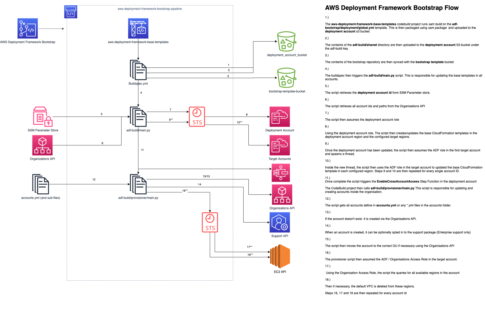
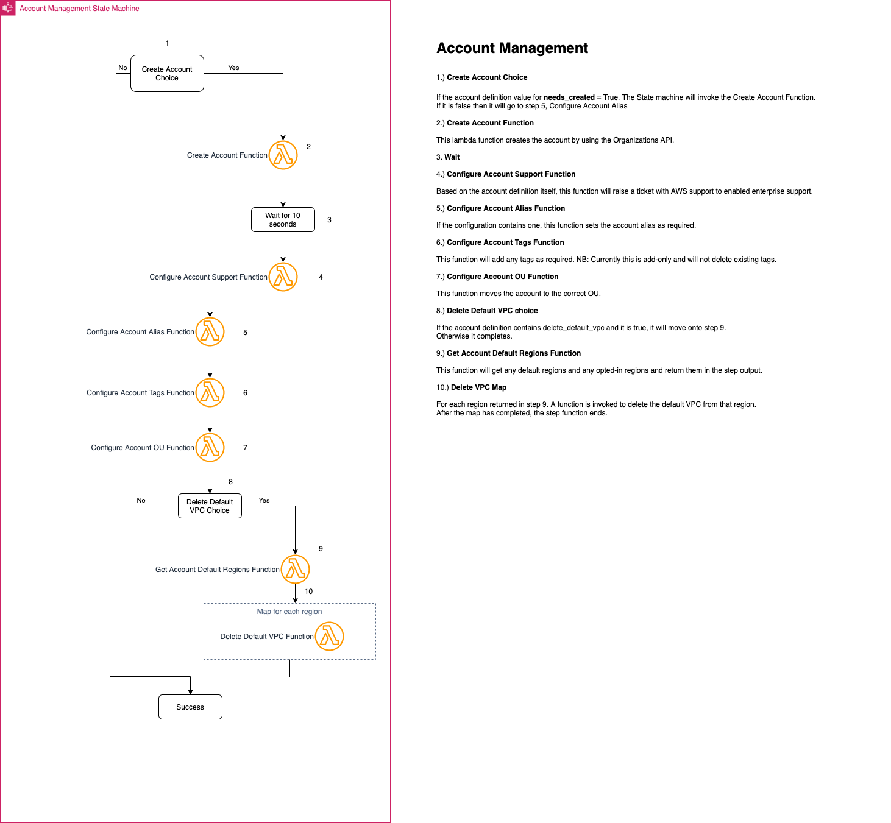

# Technical Guide
## Introduction
This document is intended to give insight into how the AWS Deployment Framework works under the hood.

## High Level Overview - AWS Deployment Framework Bootstrap Repository
The AWS Deployment Framework Bootstrap Repository aka "Bootstrap Repo" is where the source code used by ADF lives. The bootstrap repo is also where your accounts, OU layout and base templates are defined.
The flow below is a high level overview of what happens when a change is committed to this repository.

### Account Management State Machine
The Account Management State Machine is triggered by S3 PUT events to the ADF Accounts bucket.
Below is a diagram detailing the components of the standard state machine. This state machine is defined in `src/account_processing.yml` and the lambda functions code is location in `src/lambda_codebase/account_processing`

## High Level Overview - AWS Deployment Framework Pipeline Repository
The AWS Deployment Framework Pipeline Repository aka "Pipeline Rep" is where the deployment map definitions live. It typically exists in CodeCommit within your Deployment Account(s).
The diagram below details what happens when a commit is pushed to this repository.

### Pipeline Management State Machine
The Pipeline Management State machine is triggered by S3 PUT events to the ADF Pipelines bucket. This state machine is responsible for expanding the deployment map, resolving the targets, creating pipeline definitions (JSON objects that detail the source(s) and stages involved and the targets) and then generating CDK stacks off of the definitions.

It additionally covers the deletion of stale pipelines. A Stale pipeline is any pipeline that has a definition but does not exist in a deployment map.
