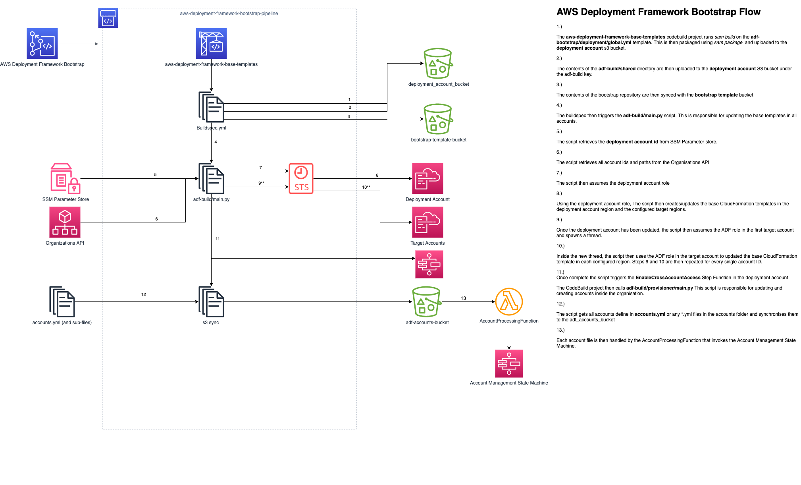

## Technical Guide
### Introduction
This document is intended to give insight into how the AWS Deployment Framework works under the hood. 

### High Level Overview - AWS Deployment Framework Bootstrap Repository
The AWS Deployment Framework Bootstrap Repository aka "Bootstrap Repo" is where the source code used by ADF lives. The bootstrap repo is also where your accounts, OU layout and base templates are defined. 
The flow below is a high level overview of what happens when a change is committed to this repository. 

