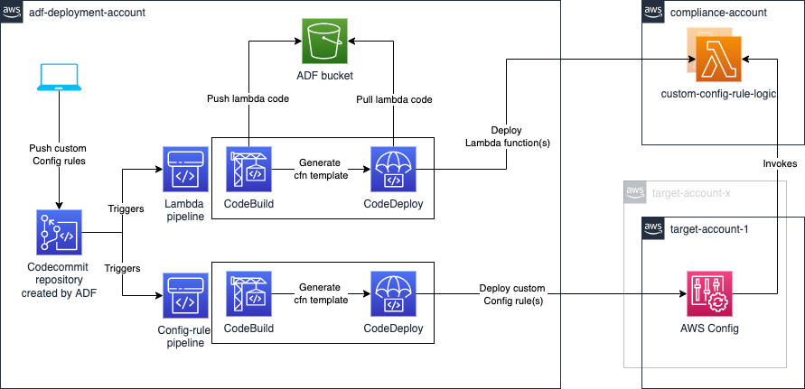
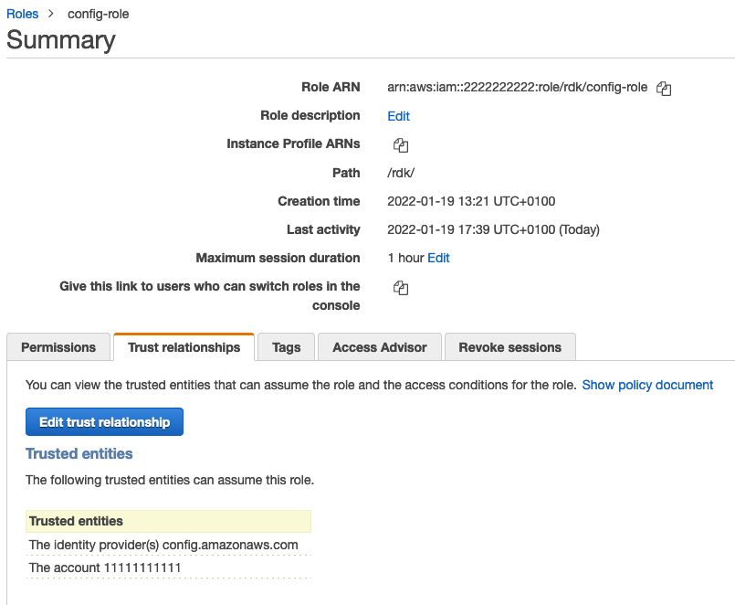

# Sample RDK Rules pipeline

This setup will allow you to deploy custom config rules created by the RDK via
ADF pipeline.

## Architecture



- As a first step it requires to have a Source code repository to store our
  code. In this pattern we are using CodeCommit repository. This repository
  created by as a part of the pipeline definition in the ADF's
  `deployment_map.yml`. Example of the pipeline definition is in the ADF setup
  section.
- ADF pipeline definition creates a pipeline that will deploy Lambda function(s)
  into the compliance account and Custom Config rule(s) to Target accounts.
- When a Custom Config rule get pushed into the CodeCommit repository;
  - CodeBuild will find the RDK rule(s) recursively in the `config-rules`
    directory then zip each single rule one by one and upload into ADF bucket.
    Buildspec is using a helper script called `lambda_helper.py` to achieve
    this task. ADF populates bucket names into SSM Parameter store on the
    installation. `lambda_helper.py` fetches the bucket name from the SSM
    Parameter Store. Parameter name looks like
    `/cross_region/s3_regional_bucket/{region}`.
  - Then CodeBuild will generate 2 CloudFormation templates one for Lambda
    function(s) deployment and other for the Custom Config rule(s) deployment.
- When a Lambda function get invokes by a Target account Custom config rule; it
  will assume the Config role in the target account then put config Evaluations
  into the Target account's Config rule.

### ADF setup

Sample pipeline definition looks like below:

```yaml
  - name: custom-config-rules-pipeline ## repo name
  default_providers:
    source:
      provider: codecommit
      properties:
        account_id: <compliance-account-id>
    build:
      provider: codebuild
      properties:
        image: "STANDARD_7_0"
    deploy:
      provider: cloudformation
  targets:
    - name: LambdaDeployment
      regions: <regions>
      target: <compliance-account-id>
      properties:
          template_filename: "template-lambda.json"
    - name: ConfigRulesDeployment
      regions: <regions>
      target:
        - <target-accounts-to-deploy-custom-config-rules>
      properties:
        template_filename: "template-config-rules.json"
```

## Development setup

After you clone the repo following file/folder structure will be there;

- `config-rules`: This folder will contain all the custom config rules created
  by `rdk create ...`. Make sure to setup correct details in the
  `parameters.json` file(ex: SourceRuntime)
- `params`: Contains parameters we need for the generated CloudFormation
  templates. You must set the account id of the Compliance account in
  `LambdaAccountId` and Target accounts Config role arn as a pattern in
  `ConfigRoleArnToAssume`. These will be used as parameters when it deploys
  config-rule into Target accounts to refer Lambda function from the Compliance
  account. [Refer this
  link](../../docs/user-guide.md#cloudformation-parameters-and-tagging)
- `templates`: This folder contains all the CloudFormation (CFn) template pieces
  that required to build CFn template for the lambda function deployment.
- `buildspec.yml`: Buildspec file to generate CloudFormation templates for the
  Lambda and Custom Config rules
- `lambda_helper.py`: This is the helper file that pack and upload the lambda
  code recursively in the config-rules folder
- `requirements.txt`: Requirements for the `lambda_helper.py` script.

## Lambda function implementation requirements

In Lambda functions when you want to refer boto3 client or resource make sure

- Set `ASSUME_ROLE_MODE` constant to `True`
- Use `get_client` method for client.
- Duplicate `get_client` and create the `get_resource` method.

```py
def get_resource(service, event, region=None):
    """Return the service boto resource. It should be used instead of directly
    calling the resource.

    Keyword arguments:
    service -- the service name used for calling the boto.resource()
    event -- the event variable given in the lambda handler
    region -- the region where the resource is called (default: None)
    """
    if not ASSUME_ROLE_MODE:
        return boto3.resource(
            service, region
        )
    credentials = get_assume_role_credentials(
        get_execution_role_arn(event),
        region
    )
    return boto3.resource(
        service, aws_access_key_id=credentials['AccessKeyId'],
        aws_secret_access_key=credentials['SecretAccessKey'],
        aws_session_token=credentials['SessionToken'],
        region_name=region
    )
```

These methods use STS and config payload to assume the IAM role in the target
account. If not lambda execution will be failed.

[More info](https://aws.amazon.com/blogs/mt/aws-config-rdk-multi-account-and-multi-region-deployment/)

## Prerequisites/ Important bits

- This solution does not setup config or config recorder.
- When this solution deploys the config-rule to a target account; it expects
  config is enabled in the target account.
- Each target account's config role should be able assume by
  `<account-that-has-the-lambda-function>` to put evaluations into each target
  account's config. AKA config role in the target account (`2222222222`) should
  have the `lambda-function-account-id` (`1111111111`) as trusted entity as
  below.


