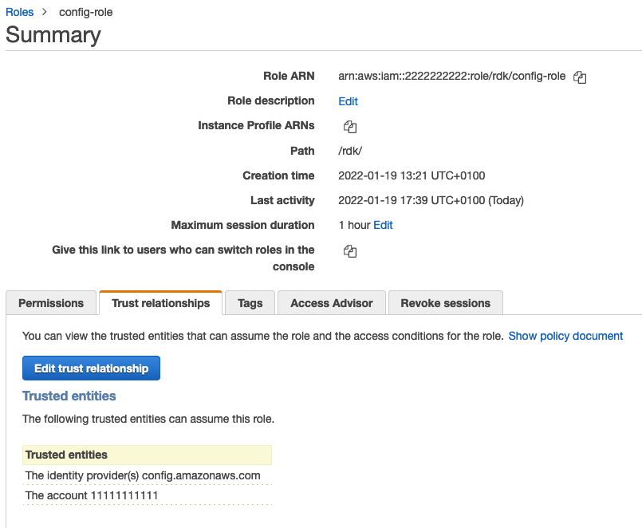

# Introduction
This setup will allow you to deploy custom config rules created by the RDK via ADF pipeline. 

## Architecture

* As a first step it requires to have a Source code repository to store our code. In this pattern we are using CodeCommit repository. This repository created by as a part of the pipeline definition in the ADF's deployment_map.yml. Example of the pipeline definition in the Code section of the pattern below.
* ADF pipeline definition creates 2 pipelines that get triggers by the single code repository. This requires because from the same code we extract the lambda function and the Config rule separately and deploy into different accounts via these 2 pipelines. 
* When a Custom Config rule get pushed into the CodeCommit repository; 
    - Lambda pipeline: It will find the RDK rule(s) recursively then zip each single rule one by one and upload into ADF bucket. Buildspec of LambdaPipeline is utilising a helper script called lambda_helper.py to achieve this task and CodeBuild will produce a CloudFormation template to deploy this Lambda function. Then CodeDeploy will use CloudFormation template created in CodeBuild phase and deploy particular Lambda function into the Compliance Account.
    - ADF Populates bucket names into SSM Parameter store. lambda_helper.py fetches the bucket name from the SSM Parameter Store. Parameter name looks like /cross_region/s3_regional_bucket/{region}.
    - Config-Rule pipeline: This pipeline will only deploy Custom Config rule(s) by referring Lambda function get deployed from Lambda pipeline. This pipeline uses rdk create-rule-template --rules-only -a  -o template-config-rules.json to produce the CloudFormation template.
* When a Lambda function get invokes by a Target account Custom config rule; it will assume the Config role in Target account then put config Evaluations into the Target account's Config rule.
### ADF setup
2 Pipelines will be similar to below:

```
- name: custom-config-rules ## repo name
    default_providers:
      source:
        provider: codecommit
        properties:
          account_id: <deployment-account-id>
      build:
        provider: codebuild
        properties:
          image: "STANDARD_5_0"
          spec_filename: "buildspec-lambda.yml"
      deploy:
        provider: cloudformation
        properties:
          template_filename: "template-lambda.json"
    targets:  
      - <deployment-account-id>

      
  - name: custom-config-rules-2
    default_providers:
      source:
        provider: codecommit
        properties:
          account_id: <deployment-account-id>
          repository: custom-config-rules ### Same repo name as above
      build:
        provider: codebuild
        properties:
          image: "STANDARD_5_0"
          spec_filename: "buildspec-config-rules.yml"
      deploy:
        provider: cloudformation
        properties:
          template_filename: "template-config-rules.json"
    targets:  
      - <target-accounts-to-deploy-custom-config-rules> 
```
As you see here each time when a commit get pushed; these 2 pipelines will be triggered. As per the current ADF version(v3.1.2) we cannot stop pipeline trigger when a commit get pushed. Unless it could be chained(when [this changes](https://github.com/awslabs/aws-deployment-framework/pull/357) get released with [`trigger_on_changes`](https://github.com/awslabs/aws-deployment-framework/blob/master/docs/providers-guide.md#codecommit) attribute).


## Development setup
After you clone the repo following file/folder structure will be there;
| Name  | Purpose  |   
|---|---|
| config-rules  | This folder will contain all the custom config rules created by `rdk create ...`. Make sure to setup correct details in the `parameters.json` file(ex: SourceRuntime) |
| params  | Contains parameters we need for the generated CloudFormation templates. You must set the account id that deployed your Lambda functions called `LambdaAccountId`. This will be used as a parameter when it deploys config-rule into Target accounts to refer Lambda function from the Compliance-account. [Refer this link](https://github.com/awslabs/aws-deployment-framework/blob/master/docs/user-guide.md#cloudformation-parameters-and-tagging)  |
| templates  | This folder contains all the cloudformation template pieces that required to build cfn template for the lambda function deployment.  |
| buildspec-lambda.yml | Buildspec file for the Lambda function deployment pipeline. Make sure this is the same name that you have defined in ADF pipeline. |
| buildspec-config-rules.yml | Buildspec file for the config-rule deployment pipeline. Make sure this is the same name that you have defined in ADF pipeline. |
| lambda_helper.py | This is the helper file that pack and upload the lambda code recursively in the config-rules folder |
| requirements.txt| Requirements for the lambda_helper.py script.|

## Lambda function implementation requirements
In Lambda functions when you want to refer boto3 client or resource make sure 
- Set `ASSUME_ROLE_MODE` constant to `True`
- Use `get_client` method for client.
- Duplicate `get_client` and create the `get_resource` method. 

```
def get_resource(service, event, region=None):
    """Return the service boto resource. It should be used instead of directly calling the resource.

    Keyword arguments:
    service -- the service name used for calling the boto.resource()
    event -- the event variable given in the lambda handler
    region -- the region where the resource is called (default: None)
    """
    if not ASSUME_ROLE_MODE:
        return boto3.resource(service, region)
    credentials = get_assume_role_credentials(get_execution_role_arn(event), region)
    return boto3.resource(service, aws_access_key_id=credentials['AccessKeyId'],
                        aws_secret_access_key=credentials['SecretAccessKey'],
                        aws_session_token=credentials['SessionToken'],
                        region_name=region
                       )
```
These methods use STS and config payload to assume the IAM role in the target account. If not lambda execution will be failed.


[More info](https://aws.amazon.com/blogs/mt/aws-config-rdk-multi-account-and-multi-region-deployment/)

## Prerequisites/ Important bits
- This solution does not setup config or config recorder.
- When this solution deploys the config-rule to a target account; it expectes config is enabled in the target account.
- Each target account's config role should be able assume by `<account-that-has-the-lambda-function>` to put evaluations into each target account's config. AKA config role in target account(2222222222) should have the lambda-function-account-id(1111111111) as trusted entity as below. 


